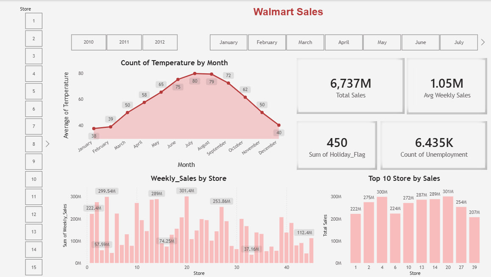

# Walmart Sales Dashboard (Power BI)

## Project Overview
This project presents an interactive sales dashboard built using Power BI to analyze Walmart store performance.

The dashboard provides insights into weekly sales trends, store performance, seasonal patterns, and external economic factors such as unemployment and temperature.

The goal of this project is to transform raw sales data into an interactive business intelligence dashboard that supports better decision-making.

---

## Tools & Technologies
- Power BI
- Power Query
- Data Modeling
- Data Visualization
- DAX (Basic Measures)

---

## Dataset
The dataset contains historical sales data for 45 Walmart stores and includes several variables that may influence sales performance.

Key columns in the dataset include:

- Store
- Date
- Weekly_Sales
- Temperature
- Fuel_Price
- CPI
- Unemployment
- Holiday_Flag

---

## Data Preparation
Data preparation was performed using Power Query inside Power BI.

Steps included:

- Inspecting dataset quality
- Verifying column data types
- Checking for missing values
- Preparing the dataset for analysis

---

## Data Modeling
A simple data model was implemented to improve filtering and dashboard interactivity.

A separate Store dimension table was created by:

- Duplicating the dataset
- Keeping only the Store column
- Removing duplicate values

The Store table was then linked to the main dataset using a relationship in the Model view.

This structure improves filtering performance and follows basic data modeling best practices.

---

## Dashboard Features

The dashboard includes several key performance indicators and visualizations:

### Key Metrics
- Total Sales
- Total Holiday Flags
- Unemployment Count
- Average Weekly Sales

### Interactive Filters
- Store
- Year
- Month

### Visualizations
- Weekly Sales by Store
- Temperature Trend by Month
- Top 10 Store by Sales

These visualizations allow users to quickly explore patterns and trends in Walmart sales data.

---

## Dashboard Preview

---

## Key Insights

Some observations from the dashboard include:

- Sales vary significantly between different Walmart stores.
- Certain months show stronger sales performance than others.
- External factors such as holidays and economic indicators may influence sales patterns.

---

## Future Improvements

Possible future improvements include:

- Creating additional DAX measures
- Adding sales trend analysis by year
- Building store performance ranking
- Adding forecasting visuals

---

## Author

Ahmad Balata  
Data Analyst
